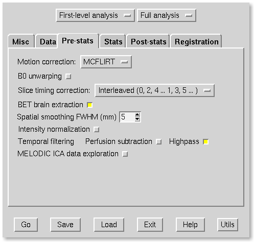
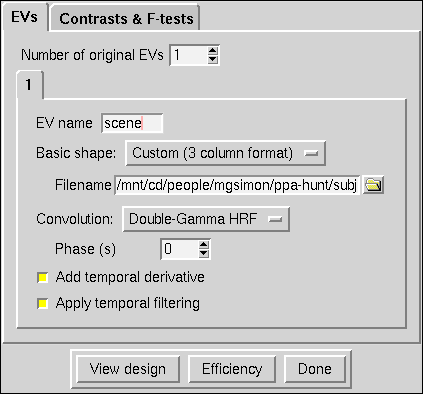
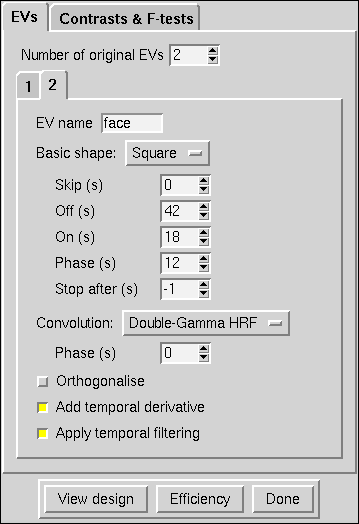
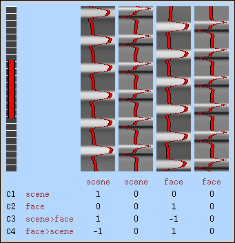
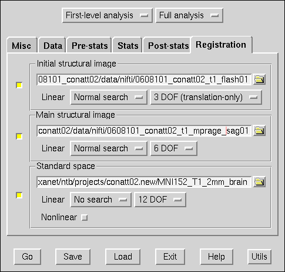

==================
NeuroPipe Tutorial
==================

:author: Mason Simon

.. contents::

------------------------------------
Chapter 1 - Within-Subjects Analysis
------------------------------------

Introduction
============

NeuroPipe is a framework for reproducible fMRI research projects. It's optimized for projects composed of within-subjects analyses that are mainly identical, which are combined into an across-subject analysis. If this describes the structure of your project, using NeuroPipe will make it simple for you to run complex analyses that can be reproduced entirely by running a single command. This simplifies the task of ensuring your analysis is bug-free, by letting you easily make a fix and test it. And, it allows others to re-run your analysis to verify your work is correct, or to build upon your project once you've finished it.

Conventions used in this tutorial
---------------------------------

- commands that must be executed on the command line will look like this: *command-to-run*
- files will be written like this: *filename.ext*
- text that must be copied exactly as specified will be written inside of double quotes, like this: "text to copy"

Installing NeuroPipe
--------------------

requirements:

- unix-based computer (use rondo if you're at princeton)
- BXH XCEDE tools
- FSL

1. `download neuropipe`_
2. extract it somewhere, and rename the extracted directory so it's named "neuropipe"

.. _download neuropipe: http://github.com/mason-work/neuropipe/archives/master

Setting up your NeuroPipe project
=================================

1. run *neuropipe/np ppa-hunt*

Creating a subject
==================

1. cd to that ppa-hunt directory
2. `download run-order.txt`_, and put it in subject-template/copy/run-order.txt
3. run ./scaffold '0608101_conatt02', without the quotes around the subject id
4. `download data`_ and put it in subjects/0608101_conatt02/data
5. cd to subjects/0608101_conatt02

.. _download run-order.txt: https://docs.google.com/leaf?id=0B5IAU_xL24AmYjNhMmM5ZGYtOTIyNi00N2RiLThhMmEtZDYyYjIwZmJlNzBl&hl=en&authkey=CPDI7NwF
.. _download data: https://docs.google.com/leaf?id=0B5IAU_xL24AmMDJiNzEyYmUtMDhlYS00ODcwLWJhYWYtYjM4YjBlNTlhNzEz&hl=en&authkey=COuh05MM

Preparing for analysis
======================

run ./analyze.sh

once it's done, take a look in data/nifti. there should be pairs of .bxh/.nii.gz files for each pulse sequence listed in run-order.txt, which you downloaded (excluding the ones called ERROR_RUN). you can open the .nii.gz files with FSLView_

.. _FSLView: http://www.fmrib.ox.ac.uk/fsl/fslview/index.html

there's also a new folder at data/qa. peek in and you'll see a ton of files. these are organized and presented by an html file at data/qa/index.html. this is a nice way to organize information that's spread across a lot of files, and NeuroPipe has adopted it. open index.html in the subject's directory, and you'll see a page with a single link on it, called QA. as your analysis progresses, it will be your job to fill this page with content that's relevant to your analysis of the subject, such as plots of the subject's data. we'll come back to this later. for now, click that QA link, and notice that you're taken to the QA page at data/qa/index.html. you should check the various diagnostics on this page to ensure that there are no quality issues with this data (such as a lot of motion) that would make it uninterpretable

GLM analysis with FEAT
======================

now that you've got some data, and know its quality is sufficient for analysis, it's time to do an analysis. we'll use FSL's FEAT to perform a GLM-based analysis. take a look at `FEAT's manual`_ to learn more about FEAT and GLM analysis in general.

.. _FEAT's manual: http://www.fmrib.ox.ac.uk/fsl/feat5/index.html

to set the parameters of the analysis, you'll need to know the experimental design. `download protocol.txt`_ and place it in the project's root directory. open protocol.txt and read it.

.. _download protocol.txt: https://docs.google.com/leaf?id=0B5IAU_xL24AmYjQxMzVlMjktZjAxYi00ODkyLTg5NmEtNTVjMTQ2YmViMGM5&hl=en&authkey=COubj8cN

launch FEAT. it opens to the Data tab. 

The Data tab
------------

select the data file data/nifti/localizer01.nii.gz. set the output directory to analysis/firstlevel/localizer_hrf. FEAT should have detected 244 volumes, but it may have mis-detected the TR length as 3.0s. if so, change that to 1.5s. because protocol.txt indicated there were 6s of disdaqs, and TR length is 1.5s, tell FEAT to delete 4 volumes. set the high pass filter cutoff to 128.

.. image:: feat-data.png

go to the Pre-stats tab.

The Pre-stats tab
-----------------

change Slice timing correction to Interleaved. leave the rest of the settings at their defaults.

go to the Stats tab.

The Stats tab
-------------

check Add motion parameters to model. now we must use the description of the experimental design from protocol.txt to set up regressors that FEAT will use. protocol.txt tells us that blocks consisted of 12 trials, each 1.5s long, with 12s rest between blocks, and 6s rest at the start to let the scanner settle down. that 6s at the start was taken care of in the Data tab, so we have a design that looks like Scene, rest, Face, rest, Scene, rest, ...

click the Model setup wizard button. it has an option for rArBrArB..., which isn't quite what we want, but close. click that button, and set the rest period to 12s, A period to 18s (12 trials * 1.5s each), and B period to 18s. click Process and close the graph that shows up. now click Full model setup, so we can eliminate that extra 12s rest at the start that the Model setup wizard gave us.

first, set EV name to "scene". FSL calls regressors EV's, short for Explanatory Variables. the wizard set the regressor shape to Square, which is right. Skip is 0. Off period is 42s, because after the wave is on, there are 12s of rest, then 18s for the other wave to go on (other block type), then another 12s of rest. On period is 18s, like we set it to be. Hover over the "Phase" text, and FEAT will explain that the wave starts with a full off period (42s in our case), and Phase can be used to adjust this; FEAT set it to 30s so that there was a 12s rest period before this wave comes on, but we don't want that, so set Phase to 42 to eliminate the off period at the start. Leave Stop after at -1, so the wave continues as long as necessary. because we don't believe the fMRI signal will actually look like a square wave, we convolve it with a function that's intended to model the hemodynamic response; change Convolution to Double-Gamma HRF. now we need to set up the face regressor. click tab 2.

change EV name to face. look at the Phase setting. FEAT set it to 0, which means that there will be a full 42s of rest before this wave gets going. but, because we have no rest at the start, there will only be 18s for the scene wave + 12s rest = 30s before we want the face wave to start. so adjust Phase to be 12. change Convolution to Double-Gamma HRF, like we did for the scene regressor.

now go to the Contrasts & F-tests tab. we don't care to run any F-tests, so decrease that from 1 to 0. FEAT already has the contrasts set up that we'd want. in each of the Title fields, replace "A" with "scene" and "B" with "face".

.. image:: feat-stats-contrasts-and-f-tests.png

close that window, and FEAT should show you a graph of your model. if it doesn't look like the one below, you've done something wrong.

go to the Registration tab.

The Registration tab
--------------------

it should already have a Standard space image selected; leave it with the default, but change the drop-down menu from Normal search to No search. check Initial structural image, and select the file subjects/0608101_conatt02/data/nifti/0608101_conatt02_t1_flash01.nii.gz. check Main structural image, and select the file subjects/0608101_conatt02/data/nifti/0608101_conatt02_t1_mprage_sag01.nii.gz.

that's it! hit Go. a web page should open in your browser showing FEAT's progress. once it's done, this webpage provides a useful summary of the analysis you just ran with FEAT. let's add it to the subject's webpage.

Modifying the subject webpage
=============================

open subjects/0608101_conatt02/scripts/make-webpage.sh in your favorite text editor. find the line where we make the link to the QA results; we'll base our link to the localizer FEAT analysis on this link. notice that the QA directory isn't referred to with the variable $QA_DIR, rather than by explicitly writing out it's path (data/qa). this is a good habit, because it allows you to change the location of the QA_DIR without changing the make-webpage.sh script itself. but where does that QA_DIR variable come from? subjects/0608101_conatt02/globals.sh. open that script in your text editor. at the bottom of the file, make a new line with the text "LOCALIZER_FIRSTLEVEL_DIR=analysis/firstlevel/localizer_hrf.feat". now switch back to make-webpage.sh. copy the line that makes the link to QA results, paste it below, and change the text '$QA_DIR/index.html' to be '$LOCALIZER_FIRSTLEVEL_DIR/report.html'. change the text "QA", inside the anchor tag to be "localizer HRF analysis".

now run analyze.sh again from within the subject's directory. don't overwrite the converted data or QA results--we're just re-running it to update the webpage. open index.html in your browser. it should have a link to the localizer HRF analysis below the QA link. click it and check that it takes you to the FEAT report.

- to learn more about shell scripts, the see `the Advanced Bash-Scripting Guide`_
- to learn more about HTML, see W3Schools_

.. _the Advanced Bash-Scripting Guide: http://tldp.org/LDP/abs/html/
.. _W3Schools: http://www.w3schools.com/html/

Finding the PPA
===============

launch fslview. do File>Open... analysis/firstlevel/localizer_hrf.feat/mean_func.nii.gz.  File>Add... analysis/firstlevel/localizer_hrf.feat/stats/zstat3.nii.gz. zstat3.nii.gz is an image of z-statistics for the scene>face contrast being different from 0, so high intensity values in a voxel indicate that the scene regressor caught much more of the variance in fMRI signal at that voxel than the face regressor. to find the PPA, we'll look for regions with really high values in this zstat3 image. set the Min threshold at the top of FSLView to something like 8, then click around in the brain to see what regions had contrast z-stats at that threshold or above. see if you can find a pair of bilateral regions with zstat's at a high threshold, around the middle of the brain; that'll be the PPA.

Repeating the analysis for a new subject
========================================

now lets see how to perform this analysis on a new subject. copy the file analysis/firstlevel/localizer_hrf.feat/design.fsf to fsfs/localizer_hrf.fsf. this fsf file contains all the information needed to re-run exactly the analysis we just did. typing "feat localizer_hrf.fsf" would do that. but we want to run that analysis on different data, and we want to put the output in a different place. so that we don't have to redo this step for each new subject, our approach will be to turn this fsf file into a template that we fill-in (automatically) for each new subject.

open localizer_hrf.fsf in your text editor.
on the line starting with "set fmri(outputdir)", replace all of the text inside the quotes with "<?= $OUTPUT_DIR ?>", if you're familiar with PHP, this syntax will be familiar
on the line starting with "set fmri(regstandard) ", replace all of the text inside the quotes with "<?= $STANDARD_BRAIN ?>"
on the line starting with "set feat_files(1)", replace all of the text inside the quotes with "<?= $DATA_FILE_PREFIX ?>"
on the line starting with "set initial_highres_files(1) ", replace all of the text inside the quotes with "<?= $INITIAL_HIGHRES_FILE ?>"
on the line starting with "set highres_files(1)", replace all of the text inside the quotes with "<?= $HIGHRES_FILE ?>"
save that file as localizer_hrf.fsf.template

now we have a template. to use it, we'll need a script that fills it in appropriately for each subject. this filling-in process is called rendering, and a script that does most of the work for you has already been provided at scripts/render-fsf-templates.sh. open that in your text editor.

it has a function called render_firstlevel. we'll use that to render the localizer template we just made. add these lines to the end of the file::

  render_firstlevel $FSF_DIR/localizer_hrf.fsf.template \
                    $FIRSTLEVEL_DIR/localizer_hrf.feat \
                    $FSL_DIR/data/standard/MNI152_T1_2mm_brain \
                    $NIFTI_DIR/${SUBJ}_localizer01 \
                    $NIFTI_DIR/${SUBJ}_t1_flash01.nii.gz \
                    $NIFTI_DIR/${SUBJ}_t1_mprage_sag01.nii.gz \
                    > $FSF_DIR/localizer_hrf.fsf           
                  
prep.sh already calls this render-fsf-templates.sh script, so the only thing left to do is to automatically run feat on the rendered fsf file. make a new script called hrf.sh. put in these lines::

  #!/bin/bash
  source globals.sh
  feat $FSF_DIR/localizer_hrf.fsf

open analyze.sh in your text editor. after the line that runs prep.sh, add this line::
  
  bash hrf.sh

that should do it! lets test this out on a new subject now.

1. cd back to your project folder.
2. run ./scaffold 0608102_conatt02.
3. cd into that new subject's directory.
4. `download data for this subject`_, and put it at data/raw.tar.gz.
5. run ./analyze.sh, and watch everything go.

.. _download data for this subject: https://docs.google.com/leaf?id=0B5IAU_xL24AmYzlkYWUzMzQtODkzMy00OTFiLWIzYTMtN2FiNDhjM2IyN2Jk&hl=en&authkey=COrG4NkM

